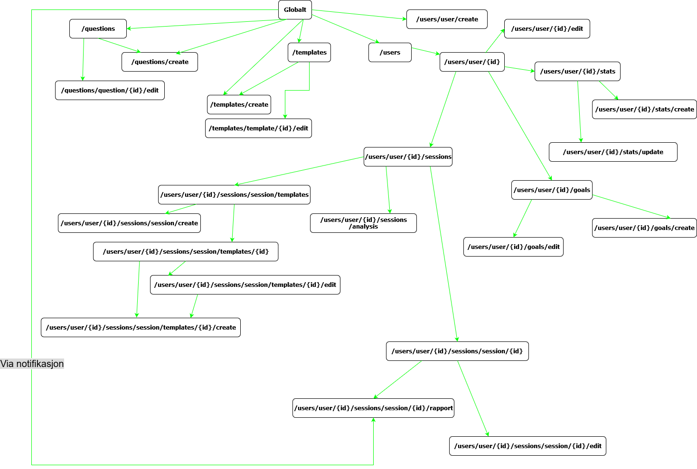
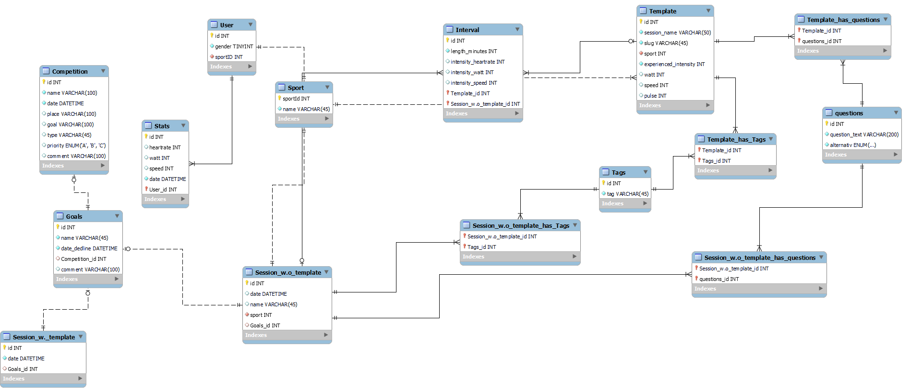

# Oppgave 2.1 - Planlegging

## API endepunkter og HTTP-verb(metoder?)

### `/users`

- **GET** - Henter ut data/liste med alle utøverne
  - `200 OK` - Vellykket og returnerer data om alle utøvere
  - `500 Internal Server Error` - Ikke vellykket og returnerer JSON.stringify av feilen
- **POST** - Oppetter en ny bruker
  - `415`
  - `400 Bad request` - Ikke vellykket og returnerer at data mangler, og spesifiserer hvilken data som er obligatorisk
  - `409 Conflict` - Ikke vellykket og returnerer en string med hva feilen omhandler(duplikat data)
  - `500 Internal Server Error` - Ikke vellykket og returnerer en string som beskriver feilen
  - `201 Created` - Vellykket

### `/users/user/{id}`

- **GET** - Henter ut informasjonen til utøveren med en gitt ID
  - `200 OK` - Vellykket og returnerer data om utøver
  - `500 Internal Server Error` - Ikke vellykket og returnerer JSON.stringify av feilen
  - `404 Not found` - Vellykket og returnerer en side med 404 Not found (utøver med den id'en ikke funnet)
- **PUT/PATCH** - Endrer data gitt om denne utøveren
  - `404 Not Found` - Vellykket og returnerer en side med 404 Not Found (utøver med den id'en ikke funnet)
  - `400 Bad request` - Ikke vellykket og returnerer at data mangler, og spesifiserer hvilken data som er obligatorisk
  - `200 OK` - Vellykket og returnerer den oppdaterte utøveren
  - `500 Internal Server Error` - Ikke vellykket og returnerer JSON.stringify av feilen
- **DELETE** - Sletter utøveren
  - `404 Not Found` - Vellykket og returnerer en side med 404 Not Found (utøver med den id'en ikke funnet)
  - `400 Bad request` - Ikke vellykket og returnerer at data mangler (id'en for utøver som skal fjernes)
  - `204 No Content` - Vellykket og sletter utøveren
  - `500 Internal Server Error` - Ikke vellykket og returnerer JSON.stringify av feilen

### `/templates`

- **GET** - Henter ut data om appens "globale" maler(de tilgjengelig for alle utøvere)
  - `200 OK` - Vellykket og returnerer data om alle globale malene
  - `500 Internal Server Error` - Ikke vellykket og returnerer JSON.stringify av feilen
- **POST** - Lager/oppetter en ny global mal
  - `415`
  - `400 Bad request` - Ikke vellykket og returnerer at data mangler, og spesifiserer hvilken data som er obligatorisk
  - `409 Conflict` - Ikke vellykket og returnerer en string med hva feilen omhandler(duplikat data)
  - `500 Internal Server Error` - Ikke vellykket og returnerer en string som beskriver feilen
  - `201 Created` - Vellykket

### `/templates/template/{id}`

- **GET** - Henter ut data om spesifikk global mal
  - `200 OK` - Vellykket og returnerer data om den spesifikke malen
  - `500 Internal Server Error` - Ikke vellykket og returnerer JSON.stringify av feilen
- **PUT/PATCH** - Endrer data/info på mal med en gitt ID
  - `404 Not Found` - Vellykket og returnerer en side med 404 Not Found (Mal med den id'en ikke funnet)
  - `400 Bad request` - Ikke vellykket og returnerer at data mangler, og spesifiserer hvilken data som er obligatorisk
  - `200 OK` - Vellykket og returnerer den oppdaterte malen
  - `500 Internal Server Error` - Ikke vellykket og returnerer JSON.stringify av feilen
- **DELETE** - Sletter global mal med gitt ID
  - `404 Not Found` - Vellykket og returnerer en side med 404 Not Found (Mal med den id'en ikke funnet)
  - `400 Bad request` - Ikke vellykket og returnerer at data mangler (id'en for mal som skal fjernes)
  - `204 No Content` - Vellykket og sletter malen
  - `500 Internal Server Error` - Ikke vellykket og returnerer JSON.stringify av feilen

### `/questions`

- **GET** - Henter data knyttet til eksempelspørsmål
  - `200 OK` - Vellykket og returnerer data om alle eksempelspørsmål
  - `500 Internal Server Error` - Ikke vellykket og returnerer JSON.stringify av feilen
- **POST** - Oppretter nytt eksempelspørsmål
  - `415`
  - `400 Bad request` - Ikke vellykket og returnerer at data mangler, og spesifiserer hvilken data som er obligatorisk
  - `409 Conflict` - Ikke vellykket og returnerer en string med hva feilen omhandler(duplikat data)
  - `500 Internal Server Error` - Ikke vellykket og returnerer en string som beskriver feilen
  - `201 Created` - Vellykket

### `/questions/question/{id}`

- **PUT/PATCH** - Endrer eksempelspørsmål med gitt ID
  - `404 Not Found` - Vellykket og returnerer en side med 404 Not Found (Spørsmål med den id'en ikke funnet)
  - `400 Bad request` - Ikke vellykket og returnerer at data mangler, og spesifiserer hvilken data som er obligatorisk
  - `200 OK` - Vellykket og returnerer det oppdaterte spørsmålet
  - `500 Internal Server Error` - Ikke vellykket og returnerer JSON.stringify av feilen
- **DELETE** - Sletter eksempelspørsmål med gitt ID
  - `404 Not Found` - Vellykket og returnerer en side med 404 Not Found (spørsmål med den id'en ikke funnet)
  - `400 Bad request` - Ikke vellykket og returnerer at data mangler (id'en for spørsmålet som skal fjernes)
  - `204 No Content` - Vellykket og sletter spørsmålet
  - `500 Internal Server Error` - Ikke vellykket og returnerer JSON.stringify av feilen

### `/users/user/{id}/stats`

- **GET** - Henter ut data knyttet til gitt utøvers stats(max-hjertefrekvens, osv)
  - `200 OK` - Vellykket og returnerer data om utøver(id) sine stats
  - `500 Internal Server Error` - Ikke vellykket og returnerer JSON.stringify av feilen
  - `404 Not found` - Vellykket og returnerer en side med 404 Not found (utøver med den id'en ikke funnet)
- **POST** - Oppretter stats for gitt utøver
  - `415`
  - `400 Bad request` - Ikke vellykket og returnerer at data mangler, og spesifiserer hvilken data som er obligatorisk
  - `500 Internal Server Error` - Ikke vellykket og returnerer en string som beskriver feilen
  - `201 Created` - Vellykket

### `/users/user/{id}/stats/{id}`

- **DELETE** - Sletter gruppe stats med gitt ID
  - `404 Not Found` - Vellykket og returnerer en side med 404 Not Found (stats med den id'en ikke funnet)
  - `400 Bad request` - Ikke vellykket og returnerer at data mangler (id'en for stats som skal fjernes)
  - `204 No Content` - Vellykket og sletter den gruppen stats
  - `500 Internal Server Error` - Ikke vellykket og returnerer JSON.stringify av feilen

### `/users/user/{id}/goals`

- **GET** - Hente ut data knyttet til utøvers mål/konkurranser
  - `200 OK` - Vellykket og returnerer data om utøver(id) sine goals
  - `500 Internal Server Error` - Ikke vellykket og returnerer JSON.stringify av feilen
  - `404 Not found` - Vellykket og returnerer en side med 404 Not found (utøver med den id'en ikke funnet)
- **POST** - Oppetter mål/konkurranse for gitt utøver
  - `415`
  - `400 Bad request` - Ikke vellykket og returnerer at data mangler, og spesifiserer hvilken data som er obligatorisk
  - `409 Conflict` - Ikke vellykket og returnerer en string med hva feilen omhandler(duplikat data)
  - `500 Internal Server Error` - Ikke vellykket og returnerer en string som beskriver feilen
  - `201 Created` - Vellykket
- **PUT/PATCH** - Endrer/oppdaterer utøver sine mål/konkurranser
  - `404 Not Found` - Vellykket og returnerer en side med 404 Not Found (utøver med den id'en ikke funnet)
  - `400 Bad request` - Ikke vellykket og returnerer at data mangler, og spesifiserer hvilken data som er obligatorisk
  - `200 OK` - Vellykket og returnerer de oppdaterte utøver sine goals
  - `500 Internal Server Error` - Ikke vellykket og returnerer JSON.stringify av feilen

### `/users/user/{id}/sessions`

- **GET** - Henter ut info/liste over gitt utøvers sine økter
  - `200 OK` - Vellykket og returnerer data om utøver(id) sine sessions
  - `500 Internal Server Error` - Ikke vellykket og returnerer JSON.stringify av feilen
  - `404 Not found` - Vellykket og returnerer en side med 404 Not found (utøver med den id'en ikke funnet)
- **POST** - Oppretter ny økt for gitt utøver
  - `415`
  - `400 Bad request` - Ikke vellykket og returnerer at data mangler, og spesifiserer hvilken data som er obligatorisk
  - `409 Conflict` - Ikke vellykket og returnerer en string med hva feilen omhandler(duplikat data)
  - `500 Internal Server Error` - Ikke vellykket og returnerer en string som beskriver feilen
  - `201 Created` - Vellykket

### `/users/user/{id}/sessions/session/{id}`

- **GET** - Henter ut data knyttet til en gitt økt
  - `200 OK` - Vellykket og returnerer data om utøver(id) sin session(id)
  - `500 Internal Server Error` - Ikke vellykket og returnerer JSON.stringify av feilen
  - `404 Not found` - Vellykket og returnerer en side med 404 Not found (session med den id'en ikke funnet)
- **PUT/PATCH** - Endrer/oppdaterer data for gitt økt
  - `404 Not Found` - Vellykket og returnerer en side med 404 Not Found (session med den id'en ikke funnet)
  - `400 Bad request` - Ikke vellykket og returnerer at data mangler, og spesifiserer hvilken data som er obligatorisk
  - `200 OK` - Vellykket og returnerer de oppdaterte utøver sin session
  - `500 Internal Server Error` - Ikke vellykket og returnerer JSON.stringify av feilen
- **DELETE** - Sletter gitt økt
  - `404 Not Found` - Vellykket og returnerer en side med 404 Not Found (session med den id'en ikke funnet)
  - `400 Bad request` - Ikke vellykket og returnerer at data mangler (id'en for session som skal fjernes)
  - `204 No Content` - Vellykket og sletter session
  - `500 Internal Server Error` - Ikke vellykket og returnerer JSON.stringify av feilen

### `/users/user/{id}/sessions/session/templates`

- **GET** - Hente ut alle maler som kan benyttes av gitt utøver
  - `200 OK` - Vellykket og returnerer data om utøver(id) sin tilgjengelige templates
  - `500 Internal Server Error` - Ikke vellykket og returnerer JSON.stringify av feilen
  - `404 Not found` - Vellykket og returnerer en side med 404 Not found (utøver med den id'en ikke funnet)

### `/users/user/{id}/sessions/session/templates/{id}`

- **GET** - Henter data knyttet til den spesifikke malen
  - `200 OK` - Vellykket og returnerer data om utøver(id) sin template(id)
  - `500 Internal Server Error` - Ikke vellykket og returnerer JSON.stringify av feilen
  - `404 Not found` - Vellykket og returnerer en side med 404 Not found (template med den id'en ikke funnet)
- **PUT/PATCH** - Endrer/oppdaterer en gitt mal
  - `404 Not Found` - Vellykket og returnerer en side med 404 Not Found (template med den id'en ikke funnet)
  - `400 Bad request` - Ikke vellykket og returnerer at data mangler, og spesifiserer hvilken data som er obligatorisk
  - `200 OK` - Vellykket og returnerer de oppdaterte utøver sin template
  - `500 Internal Server Error` - Ikke vellykket og returnerer JSON.stringify av feilen
- **DELETE** - Sletter en gitt mal
  - `404 Not Found` - Vellykket og returnerer en side med 404 Not Found (template med den id'en ikke funnet)
  - `400 Bad request` - Ikke vellykket og returnerer at data mangler (id'en for template som skal fjernes)
  - `204 No Content` - Vellykket og sletter template
  - `500 Internal Server Error` - Ikke vellykket og returnerer JSON.stringify av feilen

## Sider

Alle sidene skal vise Navbaren som skal linke til

- Siden `/questions`
- Siden `/questions/create`
- Siden `/templates`
- Siden `/templates/create`
- Siden `/users`
- Siden `/users/user/create`

For å se hvilke endepunkter hører til hver side se [skissen](#sider-som-linker-til-hvor)

### Utøvere

#### `/users`

Viser listen over alle utøverne\
Når en utøver trykkes på så går man til siden for den spesifikke utøveren `/users/user/{id}`\
Hver utøver skal også ha en tre knapper på siden av seg

- en som leder til stats `/users/user/{id}/stats`
- en til mål `/users/user/{id}/goals`
- og en som sletter utøveren

#### `/users/user/create`

Side for å legge til ny utøver\
Her skal det være felter for å fylle inn kjønn og sport/aktivitet. Bruker-id skal genereres\
Skal også være en tilbakeknapp som tar bruker tilbake til `/users` siden
og en create knapp som tar deg til den opprettede utøveren `/users/user/{id}`

#### `/users/user/{id}`

Side som viser utøverens informasjon, som userID, kjønn, sport.\
Under informasjonen ^^ så skal det være en knapp for å slette utøver, og en for å endre utøver `/users/user/{id}/edit`\
Viser også utøverens tre mål for året, og om de blir trykket på så linkes det til siden `/users/user/{id}/goals`.\
Viser utøvers nærende stats med knapp på siden som leder til `/users/user/{id}/stats`\
Har en liste over utøvers 3 siste økter, knapp på siden som lar bruker gå til den spesifikke økten `/users/user/{id}/sessions/session/{id}`, også knapp over(ved liste/tabell-tittel) som går til alle utøverens økter `/users/user/{id}/sessions`\
Ved økt listen/tabellen så skal det være en knapp for å opprette ny økt, som går til `/users/user/{id}/sessions/session/templates`

#### `/users/user/{id}/edit`

Side for å kunne endre informasjonen til en utøver\
Ligner på siden for å lage bruker, men istedet for tomme tekstfelter så er det utfylte som kan endres på.\
Har en tilbake knapp som leder tilbake til `/users/user/{id}`, knappen for å lagre endringene går samme sted.

### Maler og spørsmål

#### `/templates`

Viser en rutenett over alle templates (av de som er tilgjengelig for alle)\
Skal være en knapp over rutenettet som lar bruker opprette en ny global mal `/templates/create`\
Hver mal i tabellen skal ha en knapp for å vise malen `/templates/template/{id}`\
Og en for å endre malen `/templates/template/{id}/edit`

#### `/templates/create`

Side for å lage en ny template\
Skal ha innfyllingfelt for

- hva malen skal hete(økt den hører til)
- tags for mal
- en slug
- Hvilken aktivitet malen er laget for (dropdown meny)
- muligheten til å legge til x antall spørsmål som skal svares på
- hvilke måleparameter som skal rapporteres
- Antall intervaller med varighet og intensitetsoner

Skal være en tilbakeknapp til `/templates`\
og en create knapp som viser deg den spesifikke malen `/templates/template/{id}`

#### `/templates/template/{id}`

Side som viser en spesifikk mal\
Skal ha en tilbakeknapp som leder til `/templates`\
og en knapp som lar deg endre malen `/templates/template/{id}/edit`

#### `/templates/template/{id}/edit`

Side for endre på en global template\
Har en tilbakeknapp og en lagreknapp som leder til `/templates/template/{id}`

#### `/questions`

Viser liste over alle eksempelspørsmål som kan legges til økter og maler\
Skal ha en knapp som lar deg lage nye eksempelspørsmål `/questions/create`\
og en som lar deg endre på ett spesifikt allerede eksisterende spørsmål `/questions/question/{id}/edit`

#### `/questions/create`

Side for å operette nytt eksempelspørsmål\
Består av en tom tekstboks og en mulighet til å velge hvordan den skal kunne svares på.
Har to knapper, en for å lage og en tilbakeknapp.\
Begge leder til `/questions`

#### `/questions/question/{id}/edit`

Side for å endre på ett eksempelspørsmål\
Består av en allerede utfylt tekstboks som kan endres på og muligheten til å endre hvilket svaralternativ som skal benyttes\
Har to knapper, en for å lagre og en tilbakeknapp.\
Begge leder til `/questions`

### Trenings-stats

#### `/users/user/{id}/stats`

Denne siden skal vise en kort tabell over den spesifikke brukers nåværende stats (max-hjertefrekvens, terskelwatt, terskelfart), skal også vise de forskjellige intensitetsonene(automatisk utregnet)\
Eksempel:
| Stat/Sone | Max | Intensitet 1 | Intensitet 2 | Intensitet 3 | Intensitet 4 | Intensitet 5 |
| ---|-- |-- |-- |--| --|--|
| **Heartrate** |100% |50% |60% |70% |80% |90% |
| **Watt** | 100%|50% |60% |70% | 80%| 90%|
| **Speed** |100% | 50%| 60%|70% |80% | 90%|

Det skal også være en større tabell som viser de "arkiverte" stats, altså resultatene fra tidligere tester\
Ved tabellen over nåværende stats så skal det være en knapp for å legge til nye nåværende stats `/users/user/{id}/stats/create`\
Tabellene skal også ha en knapp for å slette ett gitt gruppe stats (en instans av max-hjertefrekvens, terskelwatt, terskelfart)

#### `/users/user/{id}/stats/create`

Side for å fylle inn nye/oppdaterte stats, skal ha tekstfelt for hver stat og skal logge dato den ble "laget".\
Når stats lagret så blir de nye lagt i "hovedtabellen" med intensitetsonene og den gamle blir lagt til "arkiv" tabellen.\
Skal ha en tilbakeknapp og en lagre-knapp begge bringer bruker tilbake til `/users/user/{id}/stats`

### Mål og konkurranser

#### `/users/user/{id}/goals`

Side viser tabeller over alle utøvers mål og/eller konkurranser\
En tabell for målene, og en for alle konkurransene\
Det skal være en knapp over hver tabell som lar deg opprette nye konkurranser eller mål\
Konkurranser leder til `/users/user/{id}/goals/create-comp`\
Mål leder til `/users/user/{id}/goals/create-goal`

Hver konkurranse/mål har også to knapper på siden av seg, en for å slette og en for å endre (`/users/user/{id}/goals/edit-comp` og `/users/user/{id}/goals/edit-goal`)

#### `/users/user/{id}/goals/create-comp`

En side for oppretting av nye konkurranser
Skal ha innfyllingfelt for

- Navn
- Dato
- Sted
- Mål (fritekst)
- Type konkurranse
- Prioritet (A, B og C)
- Kommentar

På siden skal det også være en tilbake-knapp og lagre-knapp som tar en til `/users/user/{id}/goals`

#### `/users/user/{id}/goals/create-goal`

En side for oppretting av nye mål\
Skal ha innfyllingfelt for\

- Navn
- Dato (når målet skal nås)
- Mål (tallverdi)
- Kommentar

På siden skal det også være en tilbake-knapp og lagre-knapp som tar en til `/users/user/{id}/goals`

#### `/users/user/{id}/goals/edit-comp`

Denne siden skal være for å gjøre endringer på allerede eksisterende/logga konkurranser\
Den skal ha de samme innfyllingfeltene som nevnt [create-comp](#usersuseridgoalscreate-comp)\
Skal også ha en tilbake-knapp og en lagre-knapp som tar en til `/users/user/{id}/goals`

#### `/users/user/{id}/goals/edit-goal`

Denne siden skal være for å gjøre endringer på allerede eksisterende/oppretta mål\
Den skal ha de samme innfyllingfeltene som nevnt [create-goal](#usersuseridgoalscreate-goal) \
Skal også ha en tilbake-knapp og en lagre-knapp som tar en til `/users/user/{id}/goals`

### Økter

#### `/users/user/{id}/sessions`

Side med en tabell over alle økter for denne utøveren\
Tabellen skal vise øktens dato, navn, tags, type aktivitet, antall intervaller og evt goal ID\
Over tabellen skal det være en knapp for å opprette flere økter, `/users/user/{id}/sessions/session/templates`\
Denne siden går til en for å se alle maler utøveren kan benytte seg av, eller velge å opprette en økt uten mal

#### `/users/user/{id}/sessions/session/templates`

Side som vises alle malene en utøver kan velge å bruke for en økt, OG en knapp som lar dem opprette økt uten mal\
Over en tabell med alle malene skal "opprett uten mal" knappen være\
Info om malene som skal vises i tabellen er Navnet, tags, type aktivitet og antall intervaller\
Når en template trykkes på kommer man til en side som viser hele malen, `/users/user/{id}/sessions/session/templates/{id}`

Maler som er blitt opprettet ved at bruker har justert på "globale" maler skal ha en knapp som lar de slettes

#### `/users/user/{id}/sessions/session/templates/{id}`

Siden som vier hvordan en spesifikk mal ser ut, all info om den\
Skal ha en knapp for å opprette økt ved å bruke denne malen, `/users/user/{id}/sessions/session/templates/{id}/create`\
Har en tilbakeknapp som leder til `/users/user/{id}/sessions/session/templates`\
og en knapp som lar utøver tilpasse malen, leder hit `/users/user/{id}/sessions/session/templates/{id}/edit`

#### `/users/user/{id}/sessions/session/templates/{id}/edit`

Side for å kunne tilpasse en allerede eksisterende mal, åpner for at alt av felter i malen kan justeres\
Når lagret så skal ny id bli generert og bruker blir sendt til `/users/user/{id}/sessions/session/templates/{id}` for den ny-oppretta malen

#### `/users/user/{id}/sessions/session/create` - side for å operette en økt uten template\

Siden for å opprette en økt uten mal\
Her skal det være innfyllingfelt for

- Navn
- Dato
- Tags
- Type aktivitet (en dropdown med valg)
- X antall spørsmål (velge fra database eller opprette nytt)
- Intervaller
- Treningsmål/konkurranse

#### `/users/user/{id}/sessions/session/templates/{id}/create`

Side for å opprette en økt med template\
Viser de ferdigutfylte feltene med det fra malen (deaktiverte felter som ikke kan endres på)\
De eneste feltene som kan skrives i er felt for dato og mål/konkurranse

#### `/users/user/{id}/sessions/session/{id}`

Side som viser en oversikt over en enkelt, spesifikk økt\
Den skal ha en knapp som leder deg til `/users/user/{id}/sessions/session/{id}/edit` og lar deg endre på økten\
En knapp som lar deg "rapportere"(fylle inn resultatene) på økten skal også være på siden

#### `/users/user/{id}/sessions/session/{id}/edit`

Side for å kunne gjøre endringer på en økt, som å endre dato, antall intervaller osv.\
Kan også brukes til å endre innfylt data i økter som allerede har blitt "rapportert", altså allerede gjennomførte

#### `/users/user/{id}/sessions/session/{id}/rapport`

Side for å fylle inn resultatene fra en økt, her kan kun "svar-delen" av økten fylles inn\
Når ferdig fylt inn blir bruker redirected til `/users/user/{id}/sessions/session/{id}` for å se den ferdig utfylte økten

#### `/users/user/{id}/sessions/analysis` - Side som sammenligner 2 eller flere økter

Her skal 2 eller flere økter bli sammenlignes, mer spesifikt er det intervallene som skal sammenlignes.\
Tenker det er mest praktisk å sammenligne økter av samme type aktivitet(sport)\
Filtrerer derfor økter på aktivitet/"sport"\

De filtrerte øktene vises i en tabell og for hvert krysspunkt for økt og intervall skal det være en egen tabell for overall intensitet sone for speed, watt og heartrate i den intervallen

| økt/intervall | intervall 1 | intervall 2 | intervall 3 | intervall 4 | intervall 5 |
| ------------- | ----------- | ----------- | ----------- | ----------- | ----------- |
| økt 1         |             |             |             |             |             |
| økt 2         |             |             |             |             |             |
| økt 3         |             |             |             |             |             |
|               |             |             |             |             |             |

| Meta      | Overall intensity zone |
| --------- | ---------------------- |
| Speed     |                        |
| Watt      |                        |
| Heartrate |                        |

## Sider som linker til hvor



## Datamodell

```jsx
model User {
    id              String          @id @default(uuid())
    userID          String
    gender          String
    sport           String // eller Enum - Sport
    meta            Meta[]
    activities     Activities[]
}
```

```jsx
model Meta{
    id          String      @id @default(uuid())
    date        DateTime    @default(now())
    heartrate   Int
    watt        Int
    speed       Int
}
```

```jsx
model Activities{
    id          String @id @default(uuid())
    date        DateTime @default(now())
    updatedAt   DateTime @updatedAt
    name        String?
    tags        Tag[]
    question    Question[]
    intervals   Interval[]

    Goal        Goal? @relation(fields: [goalId], references: [id], onDelete: Cascade)
    goalId      String?

}
```

```jsx
model Tag{
    id      String @id @default(uuid())
    tag     String
}
```

```jsx
model Template{
    id          String @id @default(uuid())
    name        String
    tags        Tag[]
    slug        String
    sport       String? // eller Enum - Sport
    question    Question[]
    intervals   Interval[]
}
```

```jsx
model Goal{
    id              String @id @default(uuid())
    name            String
    deadline        DateTime @default(now())
    comment         String?

    Competition     Competition? @relation(fields: [compId], references: [id], onDelete: Cascade)
    compId          String?

    User            User? @relation(fields: [userId], references: [id], onDelete: Cascade)
    userId          String?
}
```

```jsx
model Competition{
    id          String @id @default(uuid())
    name        String
    date        DateTime @default(now())
    place       String?
    goal        String?
    type        String?
    priority    String? // eller Enum - CompPriority
    comment     String?
}
```

```jsx
model Question{
    id          String @id @default(uuid())
    question    String
    type        String // eller Enum - QuestionAnswerType
}
```

```jsx
model Interval{
    id                    String @id @default(uuid())
    duration              Int
    intensity_heartrate   Int
    intensity_watt        Int
    intensity_speed       Int
}

```

```jsx
enum Sport{
    RUNNING
    BIKING
    SKIING
    TRIATHLON
    SWIMMING
    STRENGTH
    OTHER
}
enum CompPriority{
    A
    B
    C
}
enum QuestionAnswerType{
    TEXT
    RANGE
    MOOD
}
```

### Databasemodell


