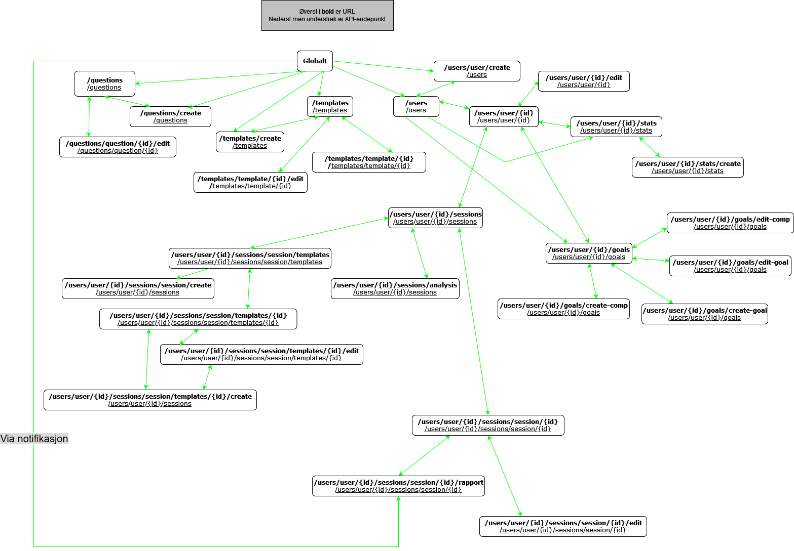

# Oppgave 2.1 - Planlegging
1. Skal dokumentere responsen og statuskoden for de ulike HTTP-verbene. Beskrive hvilke data som skal returneres ved vellykkede og mislykkede forespørsler.
## API endepunkter og HTTP-verb(metoder?)
### `/users`
- **GET** - Henter ut data/liste med alle utdøverene
    - `200 OK` - Velykket og returnerer data om alle utdøvere
    - `500 Internal Server Error` - Ikke velykket og returnerer JSON.stringify av feilen
- **POST** - Opretter en ny bruker
    - `415`
    - `400 Bad request` - Ikke velykket og returnerer at data mangler, og spesifiserer hvilken data som er obligatorisk
    - `409 Conflict` - Ikke velykket og returnerer en string med hva feilen omhandler(duplikat data)
    - `500 Internal Server Error` - Ikke velykket og returnerer en string som beskriver feilen
    - `201 Created` - Vellykket

### `/users/user/{id}`
- **GET** - Henter ut informasjonen til utdøveren med en gitt ID
    - `200 OK` - Velykket og returnerer data om utdøver
    - `500 Internal Server Error` - Ikke velykket og returnerer JSON.stringify av feilen
    - `404 Not found` - Velykket og returnerer en side med 404 Not found (utdøver med den id'en ikke funnet)
- **PUT/PATCH** - Endrer data gitt om denne utdøveren
    - `404 Not Found` - Velykket og returnerer en side med 404 Not Found (utdøver med den id'en ikke funnet)
    - `400 Bad request` - Ikke velykket og returnerer at data mangler, og spesifiserer hvilken data som er obligatorisk
    - `200 OK` - Velykket og returnerer den oppdaterte utdøveren
    - `500 Internal Server Error` - Ikke velykket og returnerer JSON.stringify av feilen
- **DELETE** - Sletter utdøveren
    - `404 Not Found` - Velykket og returnerer en side med 404 Not Found (utdøver med den id'en ikke funnet)
    - `400 Bad request` - Ikke velykket og returnerer at data mangler (id'en for utdøver som skal fjernes)
    - `204 No Content` - Velykket og sletter utdøveren
    - `500 Internal Server Error` - Ikke velykket og returnerer JSON.stringify av feilen

### `/templates`
- **GET** - Henter ut data om appens "globale" maler(de tilgjengelig for alle utdøvere)
    - `200 OK` - Velykket og returnerer data om alle globale malene
    - `500 Internal Server Error` - Ikke velykket og returnerer JSON.stringify av feilen
- **POST** - Lager/opretter en ny global mal
    - `415`
    - `400 Bad request` - Ikke velykket og returnerer at data mangler, og spesifiserer hvilken data som er obligatorisk
    - `409 Conflict` - Ikke velykket og returnerer en string med hva feilen omhandler(duplikat data)
    - `500 Internal Server Error` - Ikke velykket og returnerer en string som beskriver feilen
    - `201 Created` - Vellykket

### `/templates/template/{id}`
- **PUT/PATCH** - Endrer data/info på mal med en gitt ID
    - `404 Not Found` - Velykket og returnerer en side med 404 Not Found (Mal med den id'en ikke funnet)
    - `400 Bad request` - Ikke velykket og returnerer at data mangler, og spesifiserer hvilken data som er obligatorisk
    - `200 OK` - Velykket og returnerer den oppdaterte malen
    - `500 Internal Server Error` - Ikke velykket og returnerer JSON.stringify av feilen
- **DELETE** - Sletter global mal med gitt ID
    - `404 Not Found` - Velykket og returnerer en side med 404 Not Found (Mal med den id'en ikke funnet)
    - `400 Bad request` - Ikke velykket og returnerer at data mangler (id'en for mal som skal fjernes)
    - `204 No Content` - Velykket og sletter malen
    - `500 Internal Server Error` - Ikke velykket og returnerer JSON.stringify av feilen

### `/questions`
- **GET** - Henter data knyttet til eksempelspørsmål
    - `200 OK` - Velykket og returnerer data om alle eksempelspørsmål
    - `500 Internal Server Error` - Ikke velykket og returnerer JSON.stringify av feilen
- **POST** - Oppretter nytt eksempelspørsmål
    - `415`
    - `400 Bad request` - Ikke velykket og returnerer at data mangler, og spesifiserer hvilken data som er obligatorisk
    - `409 Conflict` - Ikke velykket og returnerer en string med hva feilen omhandler(duplikat data)
    - `500 Internal Server Error` - Ikke velykket og returnerer en string som beskriver feilen
    - `201 Created` - Vellykket

### `/questions/question/{id}`
- **PUT/PATCH** - Endrer eksempelspørsål med gitt ID
    - `404 Not Found` - Velykket og returnerer en side med 404 Not Found (Spørsmål med den id'en ikke funnet)
    - `400 Bad request` - Ikke velykket og returnerer at data mangler, og spesifiserer hvilken data som er obligatorisk
    - `200 OK` - Velykket og returnerer det oppdaterte spørsmålet
    - `500 Internal Server Error` - Ikke velykket og returnerer JSON.stringify av feilen
- **DELETE** - Sletter eksempelspørsmål med gitt ID
    - `404 Not Found` - Velykket og returnerer en side med 404 Not Found (spørsmål med den id'en ikke funnet)
    - `400 Bad request` - Ikke velykket og returnerer at data mangler (id'en for spørsmålet som skal fjernes)
    - `204 No Content` - Velykket og sletter spørsmålet
    - `500 Internal Server Error` - Ikke velykket og returnerer JSON.stringify av feilen

### `/users/user/{id}/stats`
- **GET** - Henter ut data knyttet til gitt utdøvers stats(max-hjertefrekvens, osv)
    - `200 OK` - Velykket og returnerer data om utøver(id) sine stats
    - `500 Internal Server Error` - Ikke velykket og returnerer JSON.stringify av feilen
    - `404 Not found` - Velykket og returnerer en side med 404 Not found (utdøver med den id'en ikke funnet)
- TODO: **POST** - Oppretter stats for gitt utdøver
    - `415`
    - `400 Bad request` - Ikke velykket og returnerer at data mangler, og spesifiserer hvilken data som er obligatorisk
    - `409 Conflict`
    - `500 Internal Server Error` - Ikke velykket og returnerer en string som beskriver feilen
    - `201 Created` - Vellykket
- **PUT/PATCH** - Endrer/oppdaterer stats for gitt utdøver
    - `404 Not Found` - Velykket og returnerer en side med 404 Not Found (utdøver med den id'en ikke funnet)
    - `400 Bad request` - Ikke velykket og returnerer at data mangler, og spesifiserer hvilken data som er obligatorisk
    - `200 OK` - Velykket og returnerer de oppdaterte utdøver sine stats
    - `500 Internal Server Error` - Ikke velykket og returnerer JSON.stringify av feilen

### `/users/user/{id}/goals`
- **GET** - Hente ut data knyttet til utdøvers mål/konkuranser
- **POST** - Opretter mål/konkurangse for gitt utdøver
- **PUT/PATCH** - Endrer/oppdaterer utdøver sine mål/konkuranser

### `/users/user/{id}/sessions`
- **GET** - Henter ut info/liste over gitt utdøvers sine økter
- **POST** - Oppretter ny økt for gitt utdøver

### `/users/user/{id}/sessions/session/{id}`
- **GET** - Henter ut data knyttet til en gitt økt
- **PUT/PATCH** - Endrer/oppdaterer data for gitt økt
- **DELETE** - Sletter gitt økt

### `/users/user/{id}/sessions/session/templates`
- **GET** - Hente ut alle maler som kan benyttes av gitt utdøver

### `/users/user/{id}/sessions/session/templates/{id}`
- **GET** - Henter data knyttet til den spesifikke malen
- **PUT/PATCH** - Endrer/oppdaterer en gitt mal
- **DELETE** - Sletter en gitt mal

## Sider
### Utdøvere
*/users* - Viser listen over alle utdøverne\
*/users/user/create* - Side for å legge til ny utdøver\
*/users/user/{id}* - Side som viser utdøverens informasjon, som userID, kjønn, sport. I tillegg til målene deres for året (mulig også deres neste 3-5 planlagte økter)\
*/users/user/{id}/edit* - side for å kunne endre informasjonen til en utdøver

### Maler og spørsmål
*/templates* - tabell over alle templates (av de som er tilgjenglig for alle)\
*/templates/create* - side for å lage en ny template\
*/templates/template/{id}/edit* - side for endre på en global template\

*/questions* - viser liste over alle eksempelspørsmål som kan legges til økter\
*/questions/create* - side for å oprette nytt eksempelspørsmål
*/questions/question/{id}/edit* - side for å oprette nytt eksempelspørsmål

### Trenings-stats
*/users/user/{id}/stats* - Side som viser til dataen som max-hjertefrekvens, terskelwatt, terskelfart og intensitetssonene, en tabell for nåværende og en for akriv\
*/users/user/{id}/stats/create* - side for å legge inn dataen/stats\
*/users/user/{id}/stats/update* - side for å oppdatere dataen/stats

### Mål og konkurangser
*/users/user/{id}/goals* - side med en tabell over alle utdøverens treningsmål/konkurangser\
*/users/user/{id}/goals/create* - side for å legge til nye treningsmål/konkurangser
*/users/user/{id}/goals/edit* - side for å legge til nye treningsmål/konkurangser

### Økter
*/users/user/{id}/sessions* - Side med en tabell over alle økter med denne utdøveren\
*/users/user/{id}/sessions/session/create* - side for å oprette en økt uten template\
*/users/user/{id}/sessions/session/templates/{id}/create* - side for å opprette økt med en template

*/users/user/{id}/sessions/session/templates* - side som viser alle malene som utdøveren kan benytte, eller heller velge å oprette økt uten mal\
*/users/user/{id}/sessions/session/templates/{id}* - side som viser hvordan en spesifikk mal ser ut\
*/users/user/{id}/sessions/session/templates/{id}/edit* - side for å tilpasse/endre på en mal

*/users/user/{id}/sessions/session/{id}* - viser data knyttet til den enkelte økten\
*/users/user/{id}/sessions/session/{id}/edit* - side for å endre en økt\
*/users/user/{id}/sessions/session/{id}/rapport* - side for å rapportere hvordan økten gikk\
*/users/user/{id}/sessions/analysis* - Side som sammenligner 2 eller flere økter

